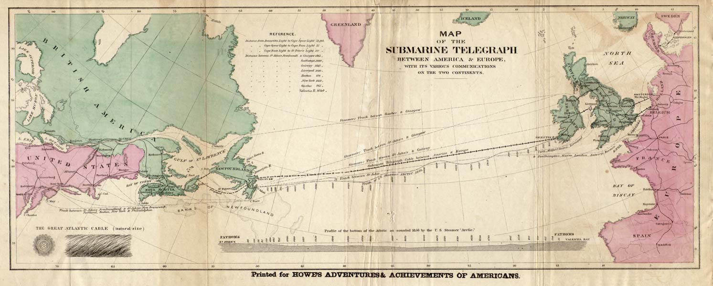
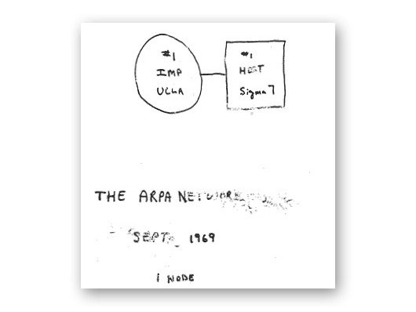
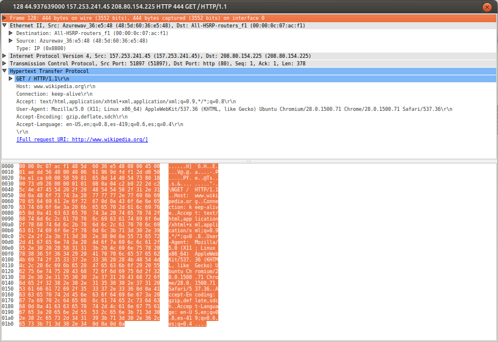

% Netwkorking
% Camilo Martinez, Gabriel Zea
% Septiembre 5 2013

# Computador como Servidor (publico)

## Mainframe

    

## Programa Informatico


## Lote de Programas
 

## Terminal


## Amazing Grace


## Computer Bug


# Comunicación en Red

## .
*Transmisión de información de manera confiable y rápida entre dos puntos*

## Red


## Telégrafo


## Cable Submarino


## Cable Submarino


# Internet
## Inicio



## wikipedia.org


## Arpanet


## Evolución


## Paquetes


## Conmutación de Paquetes (packet switching)


## Cifrado


## Enigma


# IP (Internet Protocol Address)

## RFC 791

```
 	A distinction is made between names, addresses, and routes.   A
    name indicates what we seek.  An address indicates where it is.  A
    route indicates how to get there.  The internet protocol deals
    primarily with addresses.  It is the task of higher level (i.e.,
    host-to-host or application) protocols to make the mapping from
    names to addresses.   The internet module maps internet addresses to
    local net addresses.  It is the task of lower level (i.e., local net
    or gateways) procedures to make the mapping from local net addresses
    to routes.
```

[RFC 791](https://tools.ietf.org/html/rfc791)

## A name indicates what we seek
*DNS (Domain Name System)* 

## Domain Name
**wikipedia.org**

## Árbol DNS


## Ping


## An address indicates where it is
** IP address**

## IP
```
v4:
 157.253.241.45

v6:
 fe80::4a5d:60ff:fe36:e548

```
## A route indicates how to get there

```
traceroute to wikipedia.org (208.80.152.201), 30 hops max, 60 byte packets
 1  157.253.241.3 (157.253.241.3)  20.839 ms  20.837 ms  20.830 ms
 2  157.253.91.2 (157.253.91.2)  20.823 ms  20.816 ms  20.808 ms
 3  157.253.99.99 (157.253.99.99)  26.381 ms  26.378 ms  26.367 ms
 4  corporat190-025244141.sta.etb.net.co (190.25.244.141)  28.601 ms  26.346 ms  26.339 ms
 5  corporativos2441-178.etb.net.co (201.244.1.178)  28.588 ms  28.581 ms 10.5.4.82 (10.5.4.82)  28.554 ms
 6  sl-st30-mia-0-0-2-3.sprintlink.net (144.223.245.141)  114.442 ms  96.210 ms *
 7  144.232.6.19 (144.232.6.19)  96.126 ms 144.232.6.17 (144.232.6.17)  96.057 ms 144.232.6.19 (144.232.6.19)  96.972 ms
 8  sl-crs1-hou-0-8-2-0.sprintlink.net (144.232.19.84)  110.115 ms  108.538 ms sl-crs2-mia-0-0-0-2.sprintlink.net (144.232.20.29)  116.643 ms
 9  144.232.0.128 (144.232.0.128)  111.102 ms  112.853 ms  108.413 ms
10  144.232.1.161 (144.232.1.161)  112.840 ms  112.823 ms  108.306 ms
11  144.232.11.210 (144.232.11.210)  112.744 ms 144.232.11.178 (144.232.11.178)  110.886 ms 144.232.11.210 (144.232.11.210)  112.892 ms
12  sl-tisca2-607844-0.sprintlink.net (144.228.250.98)  154.279 ms  154.273 ms  160.828 ms
13  xe-10-0-0.was10.ip4.tinet.net (141.136.108.141)  170.378 ms xe-3-2-1.was10.ip4.tinet.net (141.136.108.137)  170.320 ms xe-10-0-0.was10.ip4.tinet.net (141.136.108.141)  168.793 ms

```

# Arquitectura


# Topología de red

## Como esta estructurada la red para el flujo de datos


## Malla 


## Estrella


# Protocolos

```
	Grupo de recomendaciones y reglas que resumen una norma técnica especifico
```

# Otros protocolos

* HTTPS (Secure Hypertext Transfer Protocol)
* FTP (File Transfer Protocol)
* OSC (Open Sound Control)
* IRC (Internet Relay Chat)
* SSH (Secure Shell)
* IMAP (Internet Message Access Protocol)


# HTTP

## Definición
```
   The Hypertext Transfer Protocol (HTTP) is an application-level
   protocol for distributed, collaborative, hypermedia information
   systems. It is a generic, stateless, protocol which can be used for
   many tasks beyond its use for hypertext, such as name servers and
   distributed object management systems, through extension of its
   request methods, error codes and headers [47]. A feature of HTTP is
   the typing and negotiation of data representation, allowing systems
   to be built independently of the data being transferred.

```
[RFC 2616](https://tools.ietf.org/html/rfc2616)


## HTTP URL
```
	 http_URL = "http:" "//" host [ ":" port ] [ abs_path [ "?" query ]]
```

## Métodos
```
curl -X GET wikipedia.org

<!DOCTYPE HTML PUBLIC "-//IETF//DTD HTML 2.0//EN">
<html><head>
<title>301 Moved Permanently</title>
</head><body>
<h1>Moved Permanently</h1>
<p>The document has moved <a href="http://www.wikipedia.org/">here</a>.</p>
</body></html>

```

```
GET, PUT, UPDATE, DELETE
```

## Mensajes de respuesta
```
 2XX Exitosos
````


```
 4XX Error
```

## 404

```
404 Not Found


The server has not found anything matching the Request-URI.
```

# Lecturas Recomendada

* Standage, Tom. *The Victorian Internet : the remarkable story of the telegraph and the nineteenth centuryʼs on-line pioneers* / Tom Standage. n.p.: New York : Walker and Co., 1998., 1998.
* Galloway, Alexander R. *Protocol : How Control Exists After Decentralization*. Cambridge, Mass: MIT Press, 2004.
* Dymtri Kleiner. *The Telekommunist Manifesto*. Network Notebooks 03, Institute of Network Cultures, Amsterdam, 2010. ISBN: 978-90-816021-2-9.
